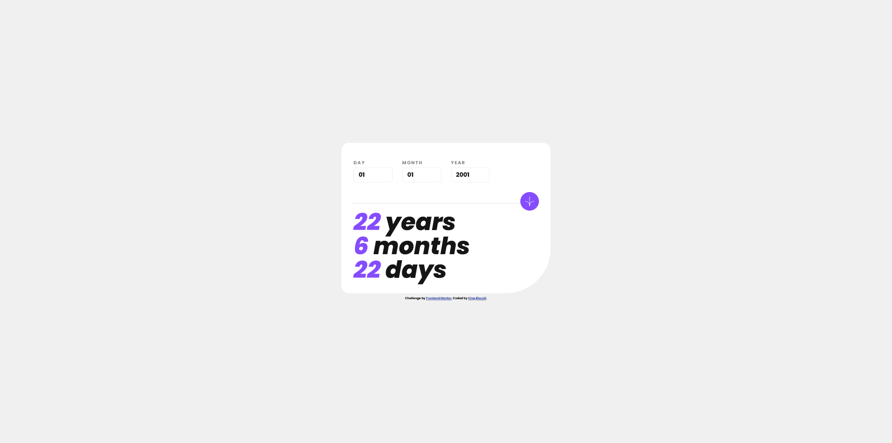
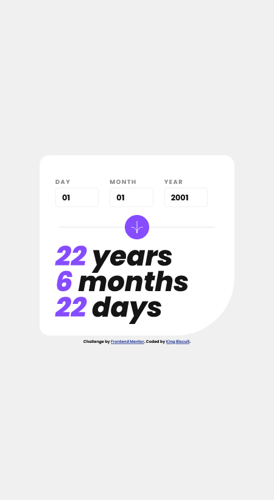

# Frontend Mentor - Age calculator app solution

This is a solution to the [Age calculator app challenge on Frontend Mentor](https://www.frontendmentor.io/challenges/age-calculator-app-dF9DFFpj-Q). Frontend Mentor challenges help you improve your coding skills by building realistic projects. 

## Table of contents

- [Overview](#overview)
  - [The challenge](#the-challenge)
  - [Screenshot](#screenshot)
- [My process](#my-process)
  - [Built with](#built-with)
  - [What I learned](#what-i-learned)
  - [Continued development](#continued-development)

## Overview

### The challenge

Users should be able to:

- View an age in years, months, and days after submitting a valid date through the form
- Receive validation errors if:
  - Any field is empty when the form is submitted
  - The day number is not between 1-31
  - The month number is not between 1-12
  - The year is in the future
  - The date is invalid e.g. 31/04/1991 (there are 30 days in April)
- View the optimal layout for the interface depending on their device's screen size
- See hover and focus states for all interactive elements on the page
- **Bonus**: See the age numbers animate to their final number when the form is submitted

### Screenshot

<figcaption align = "left"><b>Mobile version</b></figcaption>

<figcaption align = "left"><b>Desktop version</b></figcaption>

## My process

### Built with

- Semantic HTML5 markup
- CSS custom properties (Vanilla)
- Flexbox
- Mobile-first workflow
- Vanilla JS

- Before anyone who reads my code mentions it - I'm aware there's JS frameworks that allow you to do date calculation much, much easier. I just wanted to see if I could build something that works, and I kinda almost nearly kinda did.

### What I learned

- **Sometimes when you get frustrated with coding, walking away for a while can help you figure out problems in your code.**
- Using TranslateX in an animation for an asset that has a Translate X&Y value already assigned in CSS, the TranslateX attribute will reset TranslateY to default. You need to use TranslateX&Y in the animation too. 
- There's such a thing as an "outline" property which sits on top of the border but before the margin. This appears on input fields that have focus by default.
- You need to go into the HTML of an SVG in order to properly manipulate it with CSS. The preserveAspectRatio attribute need to be true and HTML width and height need to be removed for it to respond to the CSS height and width settings.
- You can create CSS variables in the root, and access them with var(). You can also do calculations in CSS with calc().
- Almost every kind of transition can have a transition time, including responsive design transitions.
- The !important tag overrides all CSS that goes against it, but you should most likely never use it.
- You don't need to use rem for every measurement, just the ones that it makes sense for (text related measurements)

### Continued development

- There's a bug that I've seen occur where a birthday starts in a leap year. The resulting calculation ends up being 1 day short. This needs to be fixed.
- I'd ideally like to prevent letters being typed at all on Firefox browsers. Letters will be caught by the validation, but it would be nice to prevent it from happening in the first place.
